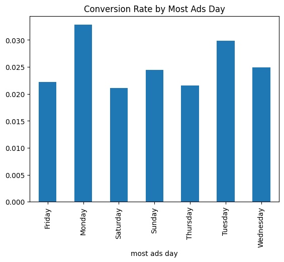

# A/B Testing Project Overview
This project aims to demonstrate my statistical skills through the analysis of an A/B testing dataset. Specifically, I have selected a dataset from Kaggle that contains information about two groups: one exposed to an advertisement (treatment group) and one not exposed (control group). I will guide you through the entire process of analyzing this data.

### Step 1: Data Exploration and Distribution Analysis

**Dataset Dimensions:** 588,101 observations with 6 features

**Important Features:** Test Group and Converted. This is what we will be goruping the data with. 

**Distrubtion of test groups:** The dataset is imbalanced, with a lot more treatment rows (97.5%) than control (2.5%). We will need to randomly select treatment rows to match the same number of control. This is to produce more robust and credible results. 

**Distribution of 'converted':** Looking at the summary statistics of this, we calculate the conversion rate. Disregarding the test group, overall, the conversion rate is 2.5%. 

*The question now becomes, does the treatment group have a higher conversion?*

### Step 2: Grouping the Data to Calculate Conversion Rates

As mentioned above, the dataset is imbalanced. The number of people who saw the ad (treatment) is 564,577, vs 23,524 who didn't see the ad (control). Now we randomly select 23,524 treatment group samples.

Just by grouping the data by the test group and analyzing the mean converted columns (conversion rate) we see that the treatment group (people who saw ads) have a conversion rate of 2.60% vs. the control group (people who didn't see ads) of 1.79%. 

Heuristically, we can say that yes, the ads do have the affect to increase conversion. But is it enough? 

In order to have a true conclusion, we will need to perform a statisical test on the two groups. 

### Step 3: Introducing the Statistical Test

With A/B testing generally t-test and chi-square is used. Since we are comparing categorical variables (ad/psa) we will be using the Chi-Square test. 

So what are the chi-square results? 

In order to move forward, we need to first state our hypothesis:

>Null Hypothesis (H0): Exposure to ads has no effect on conversion rate. 

So now, let us look at the results:

*Chi-square: 37.880253824674476, P-value: 7.522276275604638e-10*

1. **Chi-square Statistic (37.88):** This statistic measures the difference between observed and expected frequencies. A value of 37.88 indicates a significant difference. The difference meaning, how different is the actual difference between treatment and control, vs what the null hypothesis expects, no difference. 

2. **P-value (7.52e-10):** The very small p-value (0.000000000752) shows it's highly unlikely the observed association is due to chance, allowing rejection of the null hypothesis with high confidence.

So what is the business recommendation? 

> It is safe to realease treatment on full group as it statistically safe and sound that seeing ads increases the conversione rate. 

### Step 4: Further Research 

There is still valuable information in the dataset that we didn't use for the primary null hypothesis:

1. Days on which ads are seen vs. conversion rate (Chi2)
2. Numbers of ads seen vs. conversion rate (Logistic Regression)

Conclusion (1)

We can conclude with statistical signficance (p-value below 1%) that the days on which ads are seen impact the conversion rate. From this analyisis we can conclude that Monday and Tuesday have the highest conversion rates. 

